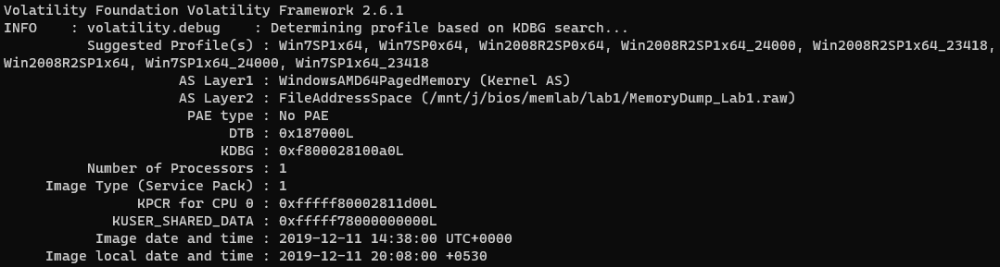
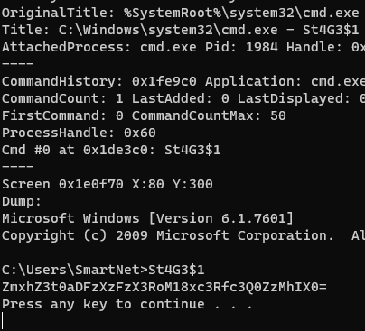
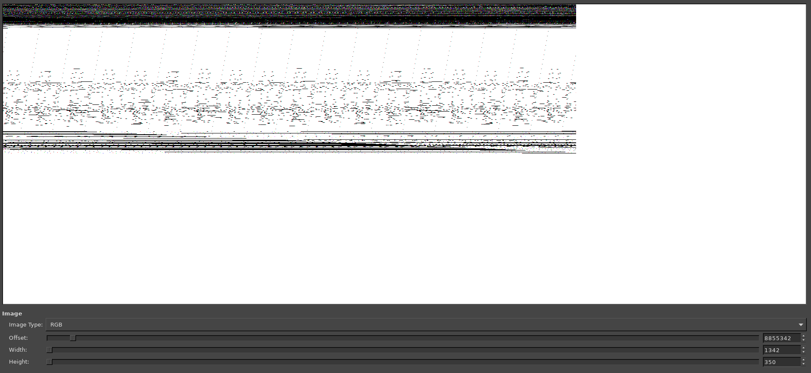
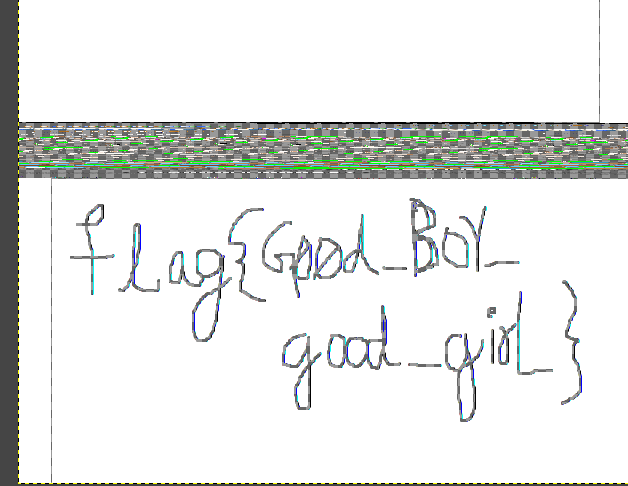
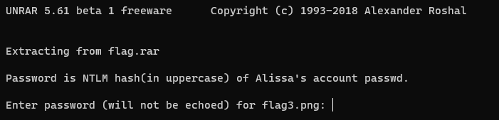
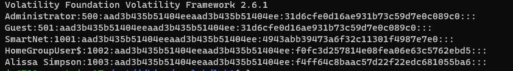

# Memlabs 1 write up 
this is a writeup for memLabs 1 available at [memlabs](https://github.com/stuxnet999/MemLabs)

## challenge discription 
My sister's computer crashed. We were very fortunate to recover this memory dump. Your job is get all her important files from the system. From what we remember, we suddenly saw a black window pop up with some thing being executed. When the crash happened, she was trying to draw something. Thats all we remember from the time of crash.

Note: This challenge is composed of 3 flags.

## solution 

firstly we have to find the image of the memory dump using imageinfo 

```bash satement 
$ vol.py -f MemoryDump_Lab1.raw imageinfo
```
on using imageinfo we get



<hr>

## Flag-01

so we now know that the profile is Win7SP1x64 

we know that a command was executed before the system shutdown hence we can use 
```bash statement
$ vol.py -f MemoryDump_Lab1.raw --profile=Win7SP1x64 consoles
```
to get the command history 



on decrypting the encoded text : ZmxhZ3t0aDFzXzFzX3RoM18xc3Rfc3Q0ZzMhIX0=

we get the first flag `flag{th1s_1s_th3_1st_st4g3!!}`

## Flag - 02

<hr>

on running the `pslist` command on volatility to show all the processes which was run 

on the list of processes which was running we can see MS paint 

Here's something about MSPaint..

MS Paint stores its content in the RAM in a bitmap. A bitmap is a rectangular grid of pixels, each of which has a color value. The color values are stored in a contiguous block of memory, and the width and height of the bitmap are stored in separate variables.

The size of the bitmap in memory is determined by the width and height of the image and the number of bits per pixel. For example, a 100x100 image with 24 bits per pixel will take up 240,000 bytes of memory.

Some other programs which uses bitmaps to store data in memory are:

  - Adobe Photoshop
  - GIMP
  - Paint.NET
  - Inkscape
  - Microsoft Photo Editor
  - Windows Photo Viewer

This means that we can recover the drawing straight from the memory dump of mspaint.exe. We can use GIMP to open up the dump as raw image data.

now we dump the memory using 
```bash statement 
 vol.py -f MemoryDump_Lab1.raw --profile=Win7SP1x64 memdump -p 2424 -D
 ```

 and then change the extention to .data

 now we can open the file using gimp

 try chainging the offset until you get a stream like this 



adjust the width and maybe change the imagetype flip it and u got the flag 



flag{Good_Boy_good_girl}

<hr>

## Flag - 03

part 3 is to recover important files 

on doing a quick filescan we can see a lot of files within the dump and dumping all of them wont be worth the time

so I try to search for files tagged important as they do that in most ctfs
so I try out 
```bash statement 
$ vol.py -f MemoryDump_Lab1.raw --profile=Win7SP1x64 filescan | grep -i important
 ```
so that worked and we know that there is a file ```important.rar```

on dumping the file using the command 
```bash statement
$ vol.py -f MemoryDump_Lab1.raw --profile=Win7SP1x64 dumpfiles -Q 0x000000003fa3ebc0 -D try
```

change the extention and on unrar ing the file a password is requested 





to get the NTLM hash we can use the hashdump command we get


  
 
 we get the password as
 
 ```F4FF64C8BAAC57D22F22EDC681055BA6```
 
 on extracting the .rar file we get a png containing the flag 

```flag{w3ll_3rd_stage_was_easy}```

