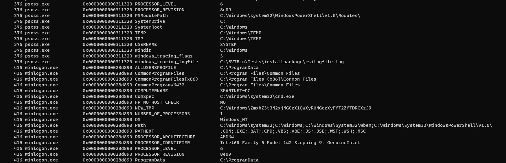
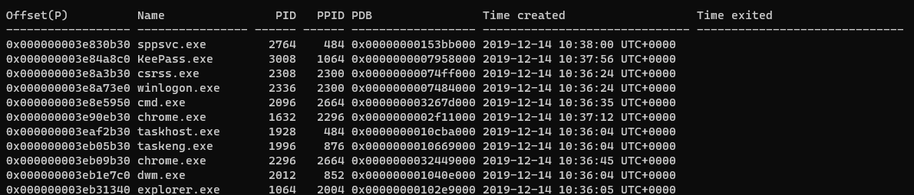
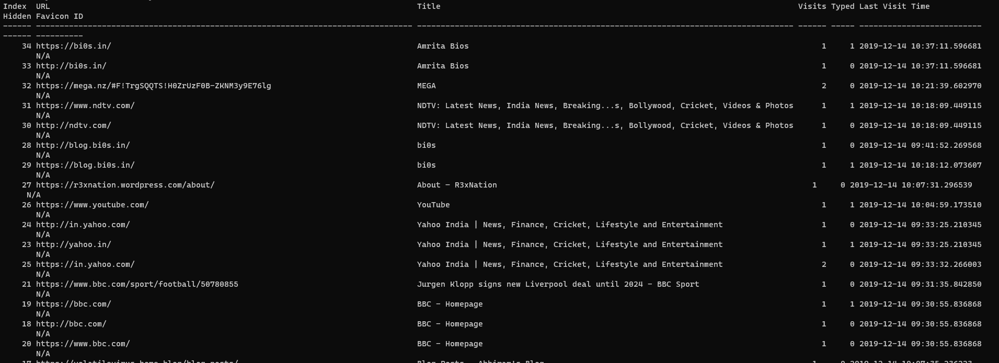
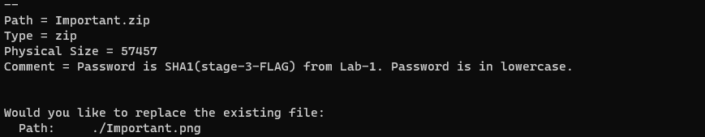

# Memlab - 02
this is a writeup for memLabs 2 available at [memlabs](https://github.com/stuxnet999/MemLabs)

## Challenge discription
One of the clients of our company, lost the access to his system due to an unknown error. He is supposedly a very popular "environmental" activist. As a part of the investigation, he told us that his go to applications are browsers, his password managers etc. We hope that you can dig into this memory dump and find his important stuff and give it back to us.

Note: This challenge is composed of 3 flags.

# Solution 
 refer memlab1 writeup for the baisic steps 

## Flag - 01
 here in they have given environmental in quotes 
 the first thing i thought to search was enviroment variables 
 using the command envars in voltality 

 Enviromnetal variables are variables defined by the system 
on checking the envars 



 ```C:\Windows\ZmxhZ3t3M2xjMG0zX1QwXyRUNGczXyFfT2ZfTDRCXzJ9```

 caught my eye on decoding the base64 encoded text u will get the first flag  ```flag{w3lc0m3_T0_$T4g3_!_Of_L4B_2}```

<hr>

 # Flag-02

On moving on to the second part of the challenge on using the psscan command I saw that the KeePass.exe was running along with chrome.exe(which will be used for the next part)





KeePass.exe is a password manager and the file extension for keepass files is ```.kdbx```
```batch statement 
vol.py --plugins=plugin/ -f MemoryDump_Lab2.raw --profile=Win7SP1x64 filescan | grep .kdbx
```
which gave me the file ```Hidden.kdbx```

```batch statement 
vol.py --plugins=plugin/ -f MemoryDump_Lab2.raw --profile=Win7SP1x64 dumpfiles -Q 0x000000003fb112a0 -D .
```

dumps the file. on trying to open the file it asks for a master password which as per the description is there in a file containg the master password as per the previous lab 1 experience I tried to search for different know extention too see if i can get anything juicy 
```batch statement 
 vol.py --plugins=plugin/ -f MemoryDump_Lab2.raw --profile=Win7SP1x64 filescan | grep .png
```
gave me ```Passwords.png```
on dumping the file the password was there on the bottom right of the Image ```Psst the password is P4SSw0rd_123```

On using the password and gaining entry into the keepass file i found the flag in recyclebin folder ```flag{w0w_th1s_1s_Th3_SeC0nD_ST4g3_!!}```
<hr>

## flag -03 

on getting the plugins to read the chrome history from [github](https://github.com/superponible/volatility-plugins)

we can use
```batch statement 
vol.py --plugins=plugin/ -f MemoryDump_Lab2.raw --profile=Win7SP1x64 chromehistory
```
to read the chrome history from the memory dump 



the link ``` https://mega.nz/#F!TrgSQQTS!H0ZrUzF0B-ZKNM3y9E76lg  ``` is a link to download a file ```MemLabs_Lab2_Stage3```
 unziping the file asks for a password  
 

 on getting submitting the password we get the png containing the flag 
 ```flag{oK_So_Now_St4g3_3_is_DoNE!!}```
  